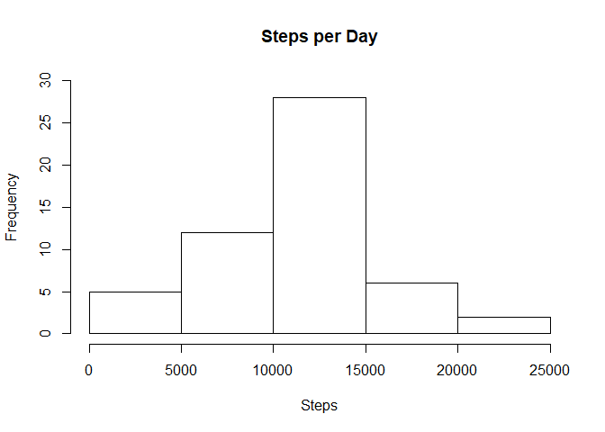
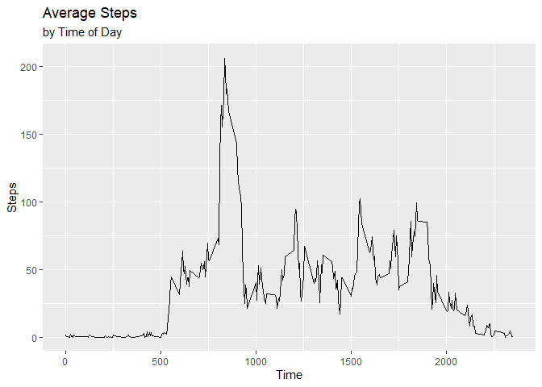
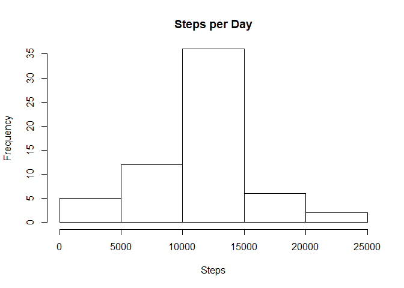
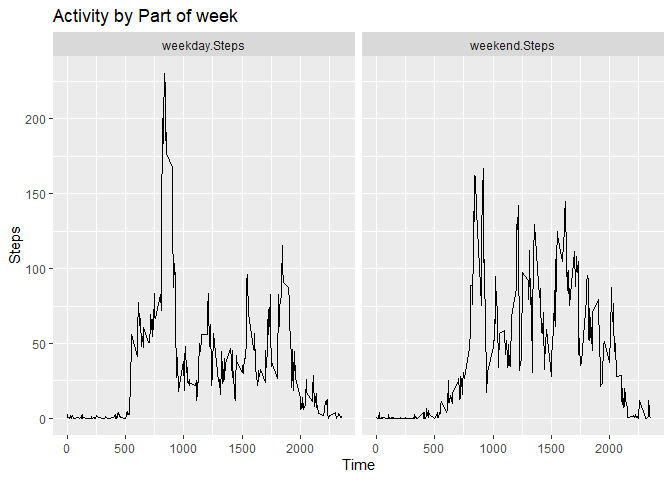

## Loading and preprocessing the data


## What is mean total number of steps taken per day?

```r
hist(daily_steps, main = 'Steps per Day', xlab = 'Steps', ylim = c(0, 30))
```

<!-- -->


```r
Mean <- mean(daily_steps, na.rm = TRUE)
```
The mean number of steps per day is 10766.1886792.


```r
Median <- median(daily_steps, na.rm = TRUE)
```
The median number of steps per day is 10765.

## What is the average daily activity pattern?

```r
print(ggplot(intervals, aes(x = Interval, y = Average.Steps)) + 
    geom_line() +
    labs(title = 'Average Steps', subtitle = 'by Time of Day') +
    xlab('Time') +
    ylab('Steps'))
```

<!-- -->


```r
high <- intervals[which.max(intervals$Average.Steps), ]
Max.Activity <- high$Average.Steps
```


```r
h <- as.integer(high$Interval) %/% 100
m <- as.integer(high$Interval) %% 100
Highest.Active.Time <- paste(h, ':', m, sep = '')
```
The highest average levels of activity were 206.1698113 steps in 5 minutes.
This occurred at 8:35.

## Imputing missing values

```r
Missing.Values <- sum(is.na(activity$steps))
```
There are 2304 missing values in the dataset. 

If we impute the missing data with the averages for the 5-minute intervals that are missing, the new data look like this:

```r
activity$steps0 <- numeric(nrow(activity))
for(i in seq_along(activity$steps)){
    if(is.na(activity[i, 'steps'])){
        activity[i, 'steps0'] <- intervals[intervals$Interval == activity[i, 'interval'],
                                           'Average.Steps']
    }else{
        activity[i, 'steps0'] <- activity[i, 'steps']
    }
}
activity0 <- data.frame('date' = activity$date, 
                        'interval' = activity$interval,
                        'steps' = activity$steps0)
daily_steps0 <- with(activity0, tapply(steps, date, sum))
hist(daily_steps0, main = 'Steps per Day', xlab = 'Steps', ylim = c(0, 35))
```

<!-- -->


```r
newMean <- mean(daily_steps0, na.rm = TRUE)
```
The imputed dataset mean number of steps per day is 10766.1886792.


```r
newMedian <- median(daily_steps0, na.rm = TRUE)
```
The imputed dataset median number of steps per day is 10766.1886792.

Imputing has done nothing with the average as we are just using the averages. The median changes slightly to reflect an imputed value that is now the median. As we can see with the histogram, the frequency of the higher step totals is raised.

## Are there differences in activity patterns between weekdays and weekends?


```r
wkdy <- c('Monday', 'Tuesday', 'Wednesday', 'Thursday', 'Friday')
activity$days <- factor(x = character(length = nrow(activity)),
                        levels = c('weekday', 'weekend'))
for(i in seq_along(activity$date)){
    if(weekdays(as.Date(activity$date[i])) %in% wkdy){
        activity[i, 'days'] <- 'weekday'
    }else{
        activity[i, 'days'] <- 'weekend'
    }
}
```


```r
weekday_means <- with(activity[activity$days == 'weekday', ],
                      tapply(steps0, interval, mean))
weekday_means <- data.frame('Interval' = names(weekday_means),
                        'weekday.Steps' = weekday_means,
                        row.names = NULL)
weekend_means <- with(activity[activity$days == 'weekend', ],
                      tapply(steps0, interval, mean))
weekend_means <- data.frame('Interval' = names(weekend_means),
                        'weekend.Steps' = weekend_means,
                        row.names = NULL)
means <- merge(weekend_means, weekday_means,
               by = intersect('Interval', 'Interval'))
means$Interval <- as.integer(as.character(means$Interval))
means <- arrange(means, Interval)
means <- means %>% gather(key = 'part.of.week', value = 'average.steps',
                          c(weekend.Steps, weekday.Steps))
```

Let's take a look at a comparison of the activity levels across time separated by weekday and weekend.


```r
p1 <- ggplot(means, aes(Interval, average.steps)) +
    geom_line() +
    labs(title = 'Activity by Part of week',
         x = 'Time',
         y = 'Steps') +
    facet_grid(cols = vars(part.of.week))
print(p1)
```

<!-- -->
